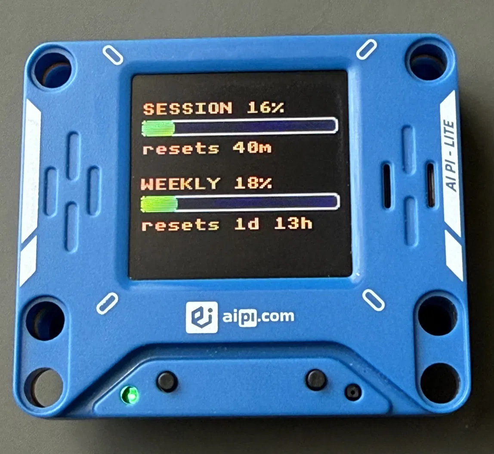

# Claude Meter — AiPi-Lite



ESP32-S3 firmware for a physical Claude usage-meter gadget. Polls the Anthropic API and displays session (5h) and weekly (7d) rate-limit utilization on a 1.44" ST7735 128×128 TFT LCD.

## Quick start

```bash
# 1. Create secrets
cp main/secrets.h.example main/secrets.h
# Edit: WIFI_SSID, WIFI_PASSWORD, CLAUDE_TOKEN

# 2. Build & flash
source ~/esp/esp-idf/export.sh
idf.py build
idf.py -p /dev/ttyACM0 flash monitor
```

## Token push (keep the device running)

The OAuth token expires. `push_claude_token.py` runs on a nearby PC to push a fresh token to the device every 4 hours.

### How it works

1. Reads your Claude Code OAuth token from `~/.claude/.credentials.json`
2. If fewer than `--margin` hours remain until expiry (default 6), forces a refresh via `claude -p ping`, re-reads, and **refuses to push a token that is still expired** — so a transient refresh failure never poisons the device with a dead token
3. POSTs the fresh token to the device, trying mDNS (`claude-meter.local`) first and **falling back to a cached/explicit IP with retries** — a flaky mDNS lookup no longer loses a whole cycle
4. Caches the device's resolved IP (`~/.cache/claude-meter-ip`) after a successful hostname push, so the fallback self-heals across DHCP changes
5. The device saves the token to NVS and polls immediately

Exit codes: `0` ok · `1` config/credentials error · `2` token not fresh (not pushed) · `3` push failed.

### Find your device

The device advertises itself as `claude-meter.local` via mDNS. To use this auto-discovery you need mDNS resolution working on the push PC:

**Avahi (most distros):**
```bash
sudo apt install avahi-daemon libnss-mdns
# Avahi should start automatically; verify it's running:
systemctl is-active avahi-daemon
# If inactive or masked:
#   sudo systemctl unmask avahi-daemon.socket
#   sudo systemctl start avahi-daemon
ping claude-meter.local    # final check
```

**systemd-resolved (systemd-based distros):**
```bash
sudo systemd-resolve --set-mdns=yes --interface=wlan0
resolvectl query claude-meter.local    # verify
```

If mDNS isn't available, find the device's IP from your router's DHCP lease table or the serial monitor output, then pass it explicitly (see below).

### Setup (systemd timer)

```bash
# Install the script to a stable path
mkdir -p ~/scripts
cp push_claude_token.py ~/scripts/
chmod +x ~/scripts/push_claude_token.py

# Create systemd user service
mkdir -p ~/.config/systemd/user
cat > ~/.config/systemd/user/claude-token-push.service << 'EOF'
[Unit]
Description=Push Claude OAuth token to Claude Meter
After=network-online.target
Wants=network-online.target

[Service]
Type=oneshot
# claude lives in a per-user dir — make sure the unit can find it.
Environment=CLAUDE_BIN=%h/.local/bin/claude
ExecStart=/usr/bin/python3 %h/scripts/push_claude_token.py
EOF

cat > ~/.config/systemd/user/claude-token-push.timer << 'EOF'
[Unit]
Description=Push Claude token every 4 hours

[Timer]
OnBootSec=2min
OnUnitActiveSec=4h
Persistent=true

[Install]
WantedBy=timers.target
EOF

# Enable and start
systemctl --user daemon-reload
systemctl --user enable --now claude-token-push.timer
```

> **Notes**
> - `Environment=CLAUDE_BIN=…` matters: under `systemctl --user` the `claude` CLI (installed in `~/.local/...`) may not be on `PATH`, which is what silently broke refreshes before.
> - The script uses mDNS by default and auto-falls-back to the cached device IP, so you usually need nothing else. For a hard guarantee, give the device a DHCP reservation and add `--ip <DEVICE-IP>` (or `Environment=CLAUDE_METER_IP=<DEVICE-IP>`) to `ExecStart`.
> - If the device requires auth (see *Web config*), add `--secret <SECRET>` or `Environment=CLAUDE_METER_SECRET=<SECRET>`.

### Requirements on the PC

- Python 3
- `claude` CLI installed and authenticated (the script runs `claude -p ping` to force token refresh)
- Network access to the device (mDNS via `claude-meter.local`, or a known IP)

### Manual push

```bash
# mDNS (auto-discovery), with an IP fallback for when mDNS is flaky
python3 push_claude_token.py --ip 192.168.1.42

# Explicit URL only
python3 push_claude_token.py --url http://192.168.1.42/

# Other flags: --secret <s>  --margin <hours>  --retries <n>  --creds <path>
```

## Hardware

| Component | Pins |
|---|---|
| ST7735 128×128 | CLK=16, MOSI=17, CS=15, DC=7, RST=18, BL=3 |
| WS2812 LED | GPIO 46 |
| Button | GPIO 42 (active-low, force poll) |
| Battery ADC | GPIO 1 (ADC1_CH1) |
| Power hold | GPIO 10 |
| ES8311 codec (I2C) | SDA=5, SCL=4 |
| Speaker amp enable | GPIO 9 |
| I2S audio | MCLK=6, BCLK=14, WS=12, DOUT=11 |

## Audio

The onboard ES8311 codec + speaker play notification tones for key events.

| Event | Sound |
|---|---|
| Boot (Wi‑Fi + SNTP ready) | C–E–G rising arpeggio |
| Button press | short C7 tick |
| Token pushed via web | C–F ascending |
| Usage crosses 60% | G–C ascending pair |
| Usage crosses 85% | three staccato beeps |
| API error | E–C descending |

Routine poll successes are silent — only threshold crossings and errors are audible.

## Web config

`http://claude-meter.local/` (or the device's IP) — view stats (now including the running firmware version + active OTA slot), paste a new token. POST a `token=` field to update the token directly.

### Optional auth

Define `CFG_AUTH_SECRET` in `main/secrets.h` to require an `X-Auth: <secret>` header on the mutating endpoints (token update and OTA). When unset, they stay open (legacy behavior). The push script passes it via `--secret` / `CLAUDE_METER_SECRET`.

> **⚠️ Security:** Without `CFG_AUTH_SECRET`, the config endpoint has no authentication — anyone on your LAN can read your usage stats or overwrite the Claude API token (which grants full access to your Claude account). On a trusted home network this is low-risk; set a secret or don't expose the device to a shared/public network.

## Firmware update (OTA)

The device runs from a two-slot OTA partition layout (16 MB flash), so after the first USB flash you can update over Wi-Fi — no cable:

```bash
idf.py build
curl --data-binary @build/claude_meter_v2.bin \
     -H 'X-Auth: <secret-if-set>' \
     http://claude-meter.local/ota
```

The device streams the image into the inactive slot, verifies it, flips the boot partition, and reboots. The stats page shows the new version + slot + OTA state (`fw <ver> · ota_N · valid`) to confirm.

> The first flash after switching to the OTA layout **must be over USB** (`idf.py flash`) — it rewrites the partition table. NVS keeps its offset, so a token already saved on the device survives.

### Auto-rollback

Rollback is enabled (`CONFIG_BOOTLOADER_APP_ROLLBACK_ENABLE`). An OTA image boots in `pending` state; once it runs stably for ~15 s in the online main loop it self-confirms (`esp_ota_mark_app_valid_cancel_rollback`) and the stats page shows `valid`. If a bad image crashes/hangs before confirming, the **next reset reverts to the previous working slot** automatically. The Wi-Fi-failure path deliberately does *not* confirm, so an update that breaks networking also rolls back on the next power cycle.

> Because rollback support lives in the **bootloader**, enabling it requires one USB flash (OTA updates the app only, not the bootloader). After that, OTA updates are rollback-protected. A USB flash is never subject to rollback (it's the recovery path).

## Architecture

See [CLAUDE.md](CLAUDE.md) for detailed architecture notes.
