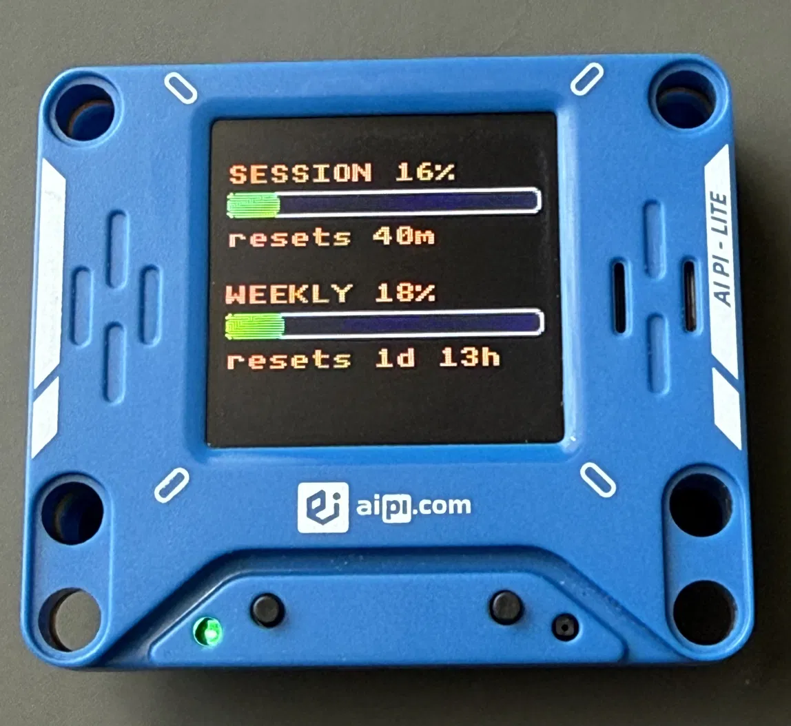

# Claude Meter v2 — AiPi-Lite



A pocket-sized Claude usage meter. An ESP32-S3 (AI-Pi Lite) with a 1.44" 128×128
screen shows your **session (5 h)** and **weekly (7 d)** usage as live rings, tells you
whether you're burning faster than the window allows, charts the last five hours,
and has an animated Clawd who reacts to how hard you're going. One button, an RGB
LED, a speaker and a LiPo battery round it out.

## What's on the screen

A tap cycles the pages; holding the button (≥ 0.6 s) refreshes and reads the result aloud.

| Page | Shows |
|---|---|
| **Rings** | Outer ring = 5 h, inner = 7 d, colored sage → amber (60 %) → red (85 %). Big session %, time to reset; weekly % and reset in the corners |
| **Pace** | Per window: bar + an *even-pace* marker (where you'd be if you spread usage evenly) and a verdict — `+12 ahead`, `on pace`, `8 under` |
| **Trend** | Last 5 h of session (coral) and weekly (grey); projection at reset, or `max @3:55` if you're on course to hit the cap |
| **Clawd** | Mood pet: chill → cooking → thinking → whoa → asleep at the limit; dances when a window resets |
| **Device** | Wi-Fi, battery, uptime, firmware, IP, data source, token host + a QR to the dashboard |

The top bar always shows the clock, page dots, a sync spinner, Wi-Fi, charging and
battery. The screen blanks after 3 min idle (configurable); the first press wakes it.

## How it gets the numbers

The device holds a Claude Code OAuth token and polls
`GET https://api.anthropic.com/api/oauth/usage` — the endpoint behind Claude Code's
`/usage`, which **costs no tokens** — every 90 s on USB power, 5 min on battery. If
that endpoint misbehaves (e.g. answers 429) it falls back to v1's method, a 1-token
`/v1/messages` call whose rate-limit headers carry the same numbers.

Tokens expire, so a host keeps the device fed: `push_claude_token.py` pushes a fresh
token every 4 h, and the device pings `notify_listener.py` the moment it comes online
or its token is rejected. The device remembers which host pushed last and pings that
one.

## Build & flash (macOS)

One-time: ESP-IDF **v5.4.4** in `~/esp/esp-idf`, installed against Homebrew
`python@3.12` (`brew install cmake ninja dfu-util python@3.12`, then
`PATH="/opt/homebrew/opt/python@3.12/libexec/bin:$PATH" ./install.sh esp32s3`).

```bash
tools/idf.sh build                 # wrapper pins the IDF Python env
tools/idf.sh flash monitor         # USB, port auto-detected (/dev/cu.usbmodem*)

# Over the air (after the first USB flash):
curl --data-binary @build/claude_meter_v2.bin http://claude-meter.local/ota
```

`main/secrets.h` is **optional**: Wi-Fi credentials and the token live in NVS. A
factory-fresh board with no `secrets.h` opens a setup access point (below); copy
`main/secrets.h.example` only to pre-seed one, or to set `CFG_AUTH_SECRET`.

`tools/shot.sh` saves what the screen shows right now as a PNG (via
`/api/screen.bmp`) — handy for UI work without looking at the desk.

## First-time Wi-Fi (setup mode)

With no stored network (or one it can't join for 20 s) the meter starts an access
point `Claude-Meter-XXXX`. Its screen shows a **QR code — scan it to join** — plus
the password (fresh each boot, shown only on the device). Your phone then opens the
setup page automatically; enter your Wi-Fi and the meter restarts and joins it.

## Token pipeline on the Mac

```bash
host/macos/install.sh            # install + start the three launchd agents
host/macos/install.sh status     # state + recent log lines
host/macos/install.sh uninstall
```

- `com.claude-meter.token-push` runs `push_claude_token.py` at login and every 4 h.
- `com.claude-meter.notify-listener` keeps `notify_listener.py` on port 5555.
- `com.claude-meter.brain` keeps `brain_server.py` on port 5556 (see *Ask it anything*).

On macOS the script reads Claude Code's credentials from the Keychain item
**"Claude Code-credentials"**; if fewer than 6 h remain it back-dates the expiry and
runs `claude -p ping` so the CLI rotates the token, and it refuses to push a dead one.

Two one-time macOS grants:
1. **Local Network** — System Settings → Privacy & Security → Local Network → enable
   **python3**. Without it the push fails with `[Errno 65] No route to host`.
2. **Keychain** — if asked whether `security` may read "Claude Code-credentials",
   choose *Always Allow*.

Logs: `~/Library/Logs/com.claude-meter.*.log`. Manual push:
`python3 push_claude_token.py [--ip 192.168.x.y] [--secret S] [--margin H]`.
`host/macos/Copy Claude Token.command` copies a fresh token to the clipboard for
pasting into the dashboard by hand.

Exit codes: `0` ok · `1` credentials error · `2` token not fresh (not pushed) · `3` push failed.

### Linux host (alternative)

The systemd units are in `host/linux/`. Credentials come from
`~/.claude/.credentials.json`.

```bash
mkdir -p ~/scripts ~/.config/systemd/user
cp push_claude_token.py notify_listener.py ~/scripts/
cp host/linux/*.service host/linux/*.timer ~/.config/systemd/user/
systemctl --user daemon-reload
systemctl --user enable --now claude-token-push.timer claude-notify-listener.service
```

Needs working mDNS (`avahi-daemon` + `libnss-mdns`) or `--ip`. Keep
`Environment=CLAUDE_BIN=%h/.local/bin/claude` — under systemd `claude` may not be on
`PATH`.

## Web dashboard

`http://claude-meter.local/` (or the IP / QR on the Device page): live rings, pace,
5 h chart, device stats (incl. heap), settings — time zone, 12/24 h clock, volume,
mute, quiet hours, brightness on USB / battery, screen-off delay — plus token paste,
Wi-Fi change, firmware upload, *Next page* and *Screenshot*.

API: `GET /api/status` · `GET /api/screen.bmp` · `POST /` (`token=`) ·
`POST /api/settings` · `POST /api/wifi` · `POST /api/poll` · `POST /api/button` ·
`POST /api/say` · `POST /voice` · `POST /ota`.

> **⚠️ Security:** without `CFG_AUTH_SECRET`, anyone on your LAN can read usage,
> change settings, replace the token or flash firmware. Fine on a trusted home
> network; otherwise define the secret (the dashboard asks for it once; the push
> script takes `--secret` / `CLAUDE_METER_SECRET`).

## Firmware updates & rollback

Two 2 MB OTA slots. An uploaded image boots on trial and confirms itself after 15 s
online; if it crashes or can't get online first, the next reset rolls back to the
previous image. USB flashing is never rolled back (it's the recovery path).

## It talks

The meter speaks through its speaker: "Claude Meter online", "Heads up. Session at
sixty one percent", "You've hit the limit. Back in one hour twenty minutes", "Fresh
window", "My token expired — asking your Mac for a fresh one". **Hold the button** and
it reads you everything: session, time to reset, weekly, and whether you're on pace.

The voice is a clip pack recorded on your Mac with `say`, stored in its own flash
partition, swappable over Wi-Fi:

```bash
tools/make_voice.py --audition "session_at #42 percent . resets_in ~9780"   # hear a sentence as the meter joins it
tools/make_voice.py --say "Good evening."                                    # any text through the voice chain
tools/make_voice.py --voice Daniel                                           # build build/voice.bin (needs numpy, ~3 min)
curl --data-binary @build/voice.bin http://claude-meter.local/voice            # install (it says hi)
```

It has a personality: most lines come in several variants, picked at random without
repeats, and now and then (at most every 45–105 min, only while you're working) it
offers an unsolicited remark. Untick **Wit** in the dashboard to stop those.
`--pitch` (default 1.04: a touch lighter and quicker) and `--style plain` change the
character. `say -v '?'` lists voices (Daniel, Samantha, Karen, Moira… or the robots: Zarvox,
Trinoids, Ralph). Turn *Talk* off in the dashboard to get the old tones back; mute
and quiet hours silence both.

## Ask it anything (brain on the Mac)

Say **"Jarvis"**, then anything. The offline command set answers what it knows
instantly; everything else goes to `brain_server.py` on the Mac that pushes the
token: whisper.cpp transcribes it, `claude -p` (your subscription, no tools, a
JARVIS persona that knows the meter's live numbers and remembers the last 10 min)
answers, and the reply comes back in the meter's own voice — about 5–7 s end to end.
Claude can also drive the meter ("show me the pace page", "mute yourself").

```bash
brew install whisper-cpp           # once; install.sh fetches the ~470 MB model
host/macos/install.sh              # starts the brain agent with the others
/usr/bin/python3 brain_server.py --test "what's the capital of Peru"   # try it on the Mac
tail -f ~/Library/Logs/com.claude-meter.brain.log                     # what it heard/said
```

`BRAIN_MODEL` (default `sonnet`) picks the Claude model. Only the meter
(`claude-meter.local`) may ask. Untick *Brain on the Mac* in the dashboard to keep
everything offline.

## Lights

The LED (very dim) is green / amber / red by the busier window, red on errors,
breathes red at the limit and blue in setup mode.

## Hardware

| Component | Pins |
|---|---|
| ST7735 128×128 | CLK 16, MOSI 17, CS 15, DC 7, RST 18, BL 3 |
| WS2812 LED | 46 |
| Button | 42 (active-low) |
| Battery ADC | 2 (ADC1_CH1) |
| Power hold | 10 |
| ES8311 codec (I2C) | SDA 5, SCL 4 |
| Speaker amp enable | 9 |
| I2S | MCLK 6, BCLK 14, WS 12, DOUT 11 |

Full reference: `docs/BOARD_REFERENCE.md`. Behavior and internals:
`docs/ARCHITECTURE.md`.

## Credits

Clawd animations from [claudepix](https://claudepix.vercel.app) (via the sibling
Clawdmeter project). JetBrains Mono (OFL, `main/fonts/OFL-JetBrainsMono.txt`).
Styrene font files carried over from the Clawdmeter project. Palette after
Clawdmeter's Anthropic-colors theme.
